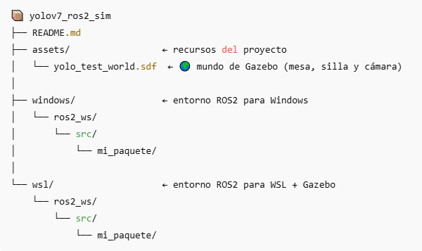
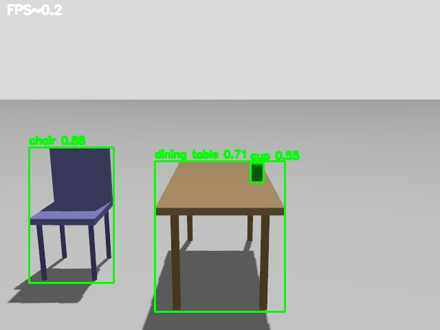

# 🚀 YOLOv7 + ROS 2 (Windows & WSL/Gazebo Integration)

Este proyecto integra **YOLOv7** con **ROS 2 Jazzy** tanto en Windows como en WSL 2 (Ubuntu 24.04 + Gazebo Harmonic).  
Permite procesar vídeo en tiempo real (webcam o simulación) y publicar detecciones, coordenadas y métricas operativas.

---

## 📂 Estructura del repositorio



---

## ⚙️ Requisitos

### Windows
- ROS 2 Jazzy para Windows  
- Python 3.12 (Numpy 1.26.4, Torch '2.5.1+cu121', Opencv '4.10.0')

### WSL 2 / Ubuntu
- ROS 2 Jazzy (nativo en Ubuntu 24.04)
- Gazebo Harmonic
- Python 3.12  (Numpy 1.26.4, Torch '2.5.1+cu121', Opencv '4.10.0')

---

## 🪟 Ejecución en **Windows**

> Asegúrate de tener los pesos (`yolov7.pt`, `yolov7_dog.pt`) en `C:\ai\yolov7\` y el entorno ROS 2 cargado.

### 1️⃣ Publicar la cámara local / video 
```bat
ros2 run mi_paquete cam_pub / vid_pub
```
👉 Publica los frames de la webcam en el tópico /camera/image_raw.


### 2️⃣ Ejecutar detección YOLOv7 general (COCO)
```bat
ros2 run mi_paquete yolo_v7 --ros-args 
  -p weights:=C:\ai\yolov7\yolov7.pt 
  -p names_yaml:=C:\ai\yolov7\data\coco.yaml 
  -p conf:=0.75 -p img_size:=640
```
👉 Lanza YOLOv7 en tiempo real con las clases COCO.


### 3️⃣ Detección especializada (ej. perros)
```bat
ros2 run mi_paquete yolo_v7 --ros-args 
  -p weights:=C:\ai\yolov7\yolov7_dog.pt 
  -p names_yaml:=C:\ai\yolov7\data\dog.yaml 
  -p conf:=0.75 -p img_size:=320
```
👉 Modelo entrenado solo para la clase “perro”.

### 4️⃣ Visualizar detecciones
```bat
ros2 run mi_paquete image_viewer --ros-args -p image_topic:=/yolo/annotated
```
👉 Muestra la imagen anotada con las cajas de detección.

### 5️⃣ Nodo de alerta
```bat
ros2 run mi_paquete alert_person_node
```
👉 Publica una alerta cuando se detecta una persona.


### 6️⃣ Inspeccionar tópicos
```bat
ros2 topic echo yolo/detections
ros2 topic echo yolo/target_point
ros2 topic echo yolo/metrics
```
👉 Muestra las detecciones, coordenadas del objetivo y métricas (fps, confianza media, etc.).

### 7️⃣ Deshabilitar detección (servicio)
```bat
ros2 service call /yolo/enable std_srvs/srv/SetBool "{data: false}"
```
👉 Llama al servicio para pausar o reanudar la detección en el nodo YOLOv7.

## 🎬 Demos en video

| Funcionalidad | Enlace YouTube |
|----------------|----------------|
| 📸 cam_pub (Webcam local) | [Ver demo](https://youtu.be/6up0zICNwzI) |
| 🎞️ video_pub (Detección general) | [Ver demo](https://youtu.be/CZsttRGi1jA) |
| 🐶 video_pub (Detección de perros) | [Ver demo](https://youtu.be/8AsDb_kmJzk) |

## 🐧 Ejecución en **WSL 2 + Gazebo**

> Antes de ejecutar los comandos, asegúrate de haber configurado correctamente tu entorno ROS 2 en WSL.
> Asegúrate de tener los pesos (`yolov7.pt`, `yolov7_dog.pt`) en `$HOME$\ai\yolov7\` y el entorno ROS 2 cargado.

---

### 1️⃣ Lanzar el mundo de prueba en Gazebo
```bash
gz sim ~/gazebo_worlds/yolo_test_world.sdf
```
🌍 Inicia el entorno de simulación en Gazebo con una cámara RGB activa.
Se ha creado un entorno de simulación en Gazebo (assets/yolo_test_world.sdf) que incluye una mesa, una silla y una cámara RGB fija.
Este mundo sirve como escenario básico para probar la detección de objetos mediante YOLOv7 en un entorno controlado.

### 2️⃣ Crear el puente entre Gazebo y ROS 2
```bash
ros2 run ros_gz_bridge parameter_bridge /camera/image_raw@sensor_msgs/msg/Image@gz.msgs.Image
```
🔗 Establece la comunicación entre la cámara simulada de Gazebo y ROS 2, publicando las imágenes en /camera/image_raw.

### 3️⃣ Ejecutar el nodo YOLOv7 sobre la simulación
```bash
ros2 run mi_paquete yolo_v7 --ros-args \
  -p weights:=/home/usuario/ai/yolov7/yolov7.pt \
  -p names_yaml:=/home/usuario/ai/yolov7/data/coco.yaml \
  -p device:=cuda -p conf:=0.75 -p input_topic:=/camera/image_raw
```
🤖 Lanza YOLOv7 procesando los frames del entorno simulado y publica las imágenes anotadas en /yolo/annotated.

### 4️⃣ Visualizar la cámara gazebo y las detecciones
```bash
ros2 run mi_paquete image_viewer --ros-args -p image_topic:=/camera/image_raw
ros2 run mi_paquete image_viewer --ros-args -p image_topic:=/yolo/annotated
```
🖼️ Muestra la salida de YOLOv7 con las detecciones superpuestas en tiempo real.

## 🎬 Demo en video



| Funcionalidad | Enlace YouTube |
|----------------|----------------|
| 📸 Cámara gazebo | [Ver demo](https://youtu.be/cXyTnm1nQeI) |
